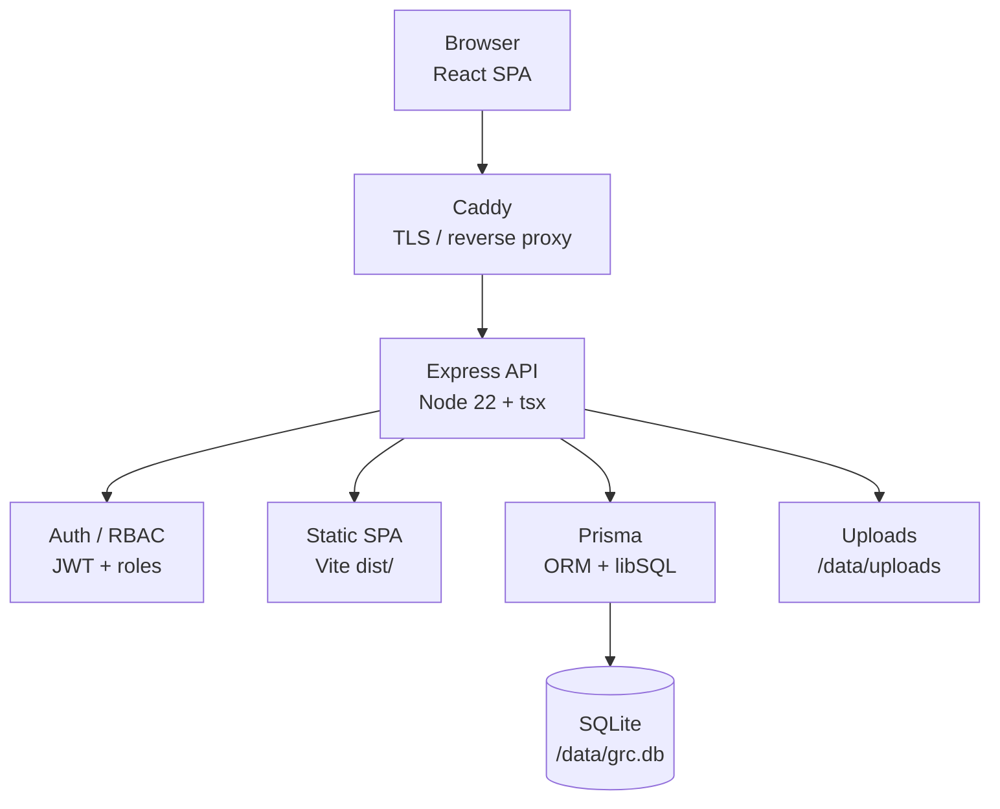

# NovaPay GRC

Governance, Risk, and Compliance (GRC) pilot application for managing controls, projects, evidence, risks, and remediation tasks.

Built for NovaPay with support for **Ukrainian** and **English** interfaces.

> Ukrainian version: [README.uk.md](README.uk.md)

## Features

- **Dashboard** — compliance overview and key metrics
- **Projects** — scoped compliance initiatives with project-specific controls
- **Controls Repository** — master library of GRC controls (PCI DSS, enterprise frameworks)
- **Controls & Evidence Database** — browse controls with evidence and design notes
- **Task Management** — track remediation and mitigation actions
- **Risk Register** — risk criteria matrix and risk items
- **Policies & Documents** — policy and document management views
- **Roadmap** — compliance roadmap planning
- **Integrations** — integration configuration UI
- **Copilot** — GRC assistant interface

### Project controls

- Import controls from the repository into a project
- Group controls by domain (category) with expand/collapse
- Filter by owner, status, and evidence presence
- Attach files to each control (upload, download, delete)
- **Mitigation actions** — when enabled, automatically create linked tasks in Task Management

## Tech stack

| Layer | Technology |
|---|---|
| Frontend | React 19, Vite, Tailwind CSS, React Router |
| Backend | Express 5, TypeScript |
| Database | SQLite (libSQL) via Prisma |
| Auth | JWT, bcrypt, RBAC + company-scoped access |
| i18n | i18next |
| File uploads | multer |
| Production | Docker, Caddy (TLS reverse proxy) |

## Architecture

NovaPay GRC is a single-VM pilot: a React SPA and Express API backed by SQLite, fronted by Caddy on GCP Compute Engine.



**Request path:** HTTPS → Caddy → Express (`:3001`) → JWT auth middleware → Prisma → SQLite / file uploads.

**Data model (API-backed):** `User` (role + company ACL), `GRCControl` (master controls repository), `Project`, `ProjectControl` (project-scoped copies with evidence). Some UI modules (e.g. parts of risks/tasks) still use client-side seed data.

**Security:** Five roles (`admin`, `approver`, `implementer`, `reviewer`, `auditor`) with a permission matrix. Non-admin users are scoped to assigned companies; projects are filtered server-side by company access.

**Deployment:** Docker Compose runs two containers (`app` + `caddy`). Persistent data lives in the `grc-data` volume at `/data`. See [docs/deploy-gcp.md](docs/deploy-gcp.md).

###  architecture 

- System context diagram (Browser → Caddy → Express → Auth / Prisma → SQLite)
- Technology stack table
- Read/write data flow walkthroughs
- Domain model and RBAC + multi-company access notes
- GCP deployment topology

## Prerequisites

- **Node.js** 22+
- **npm** 10+

## Local development

```bash
# Install dependencies
npm install

# Run database migrations
npx prisma migrate deploy

# Optional: seed sample data
npm run seed

# Start API (port 3100) + frontend (port 5173)
npm run dev
```

Open [http://localhost:5173](http://localhost:5173).

The Vite dev server proxies `/api` requests to the Express API.

### Environment variables

Create a `.env` file in the project root (optional for local dev):

```env
DATABASE_URL="file:./grc.db"
PORT=3100
UPLOAD_DIR=./uploads/projects
```

## Import controls

Import the enterprise control library from an Excel file:

```bash
npm run import-controls
```

Import PCI DSS 4.0 controls:

```bash
npm run import-pci
```

The enterprise import expects `NovaPay_Enterprise_Control_Library (1).xlsx` in the project root.

## Production build

```bash
npm run build
NODE_ENV=production npm start
```

In production mode, Express serves the built SPA from `dist/` and the API on the same port (default **3001** in Docker).

## Docker deployment

```bash
# Optional: set your domain for automatic HTTPS
echo 'GRC_DOMAIN=grc.yourdomain.com' > .env.deploy

docker compose build
docker compose up -d
```

Health check:

```bash
curl -s http://127.0.0.1:3001/api/health
```

Persistent data (SQLite database and file uploads) is stored in the `grc-data` Docker volume at `/data`.

## Deploy to GCP

See the full guide: [docs/deploy-gcp.md](docs/deploy-gcp.md)

Recommended VM: **e2-small** on Compute Engine with Ubuntu 22.04, Docker Compose, and Caddy for HTTPS.

## Project structure

```
├── src/                 # React frontend (pages, components, contexts)
├── server/              # Express API routes
├── prisma/              # Schema, migrations, import scripts
├── deploy/              # Caddy reverse proxy config
├── docs/                # Deployment documentation
├── Dockerfile
└── docker-compose.yml
```

## Scripts

| Command | Description |
|---|---|
| `npm run dev` | Start API + frontend in development |
| `npm run build` | Type-check and build frontend |
| `npm start` | Run production server |
| `npm run seed` | Seed database with sample data |
| `npm run import-controls` | Import enterprise controls from Excel |
| `npm run import-pci` | Import PCI DSS controls |

## API

| Endpoint | Description |
|---|---|
| `GET /api/health` | Health check |
| `GET /api/controls` | List all controls |
| `GET /api/projects` | List projects |
| `GET /api/projects/:id/controls` | Project controls |
| `POST /api/projects/:id/controls/:controlId/attachments` | Upload attachment |

## License

Private — NovaPay internal pilot.
