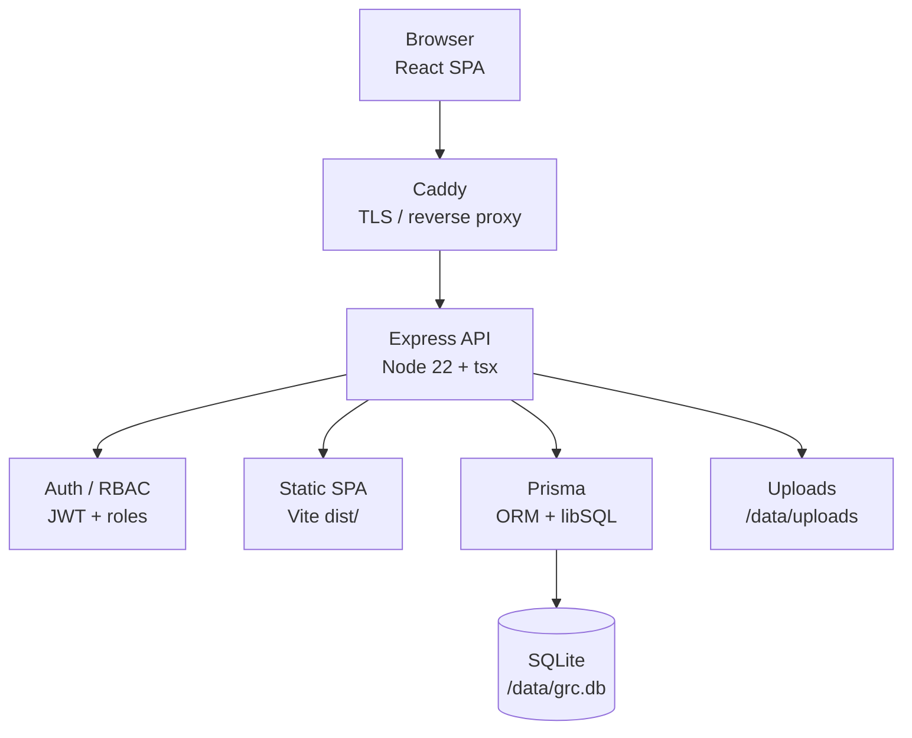

# NovaPay GRC

Пілотний застосунок Governance, Risk, and Compliance (GRC) для управління контролями, проєктами, доказами, ризиками та задачами з усунення порушень.

Розроблено для NovaPay з підтримкою інтерфейсу **українською** та **англійською** мовами.

> Англійська версія: [README.md](README.md)

## Можливості

- **Dashboard** — огляд комплаєнсу та ключові метрики
- **Projects** — проєкти комплаєнсу з контролями на рівні проєкту
- **Controls Repository** — мастер-бібліотека GRC-контролів (PCI DSS, ISO 27001, NBU, enterprise frameworks)
- **Controls & Evidence Database** — перегляд контролів з доказами та design notes
- **Task Management** — відстеження remediation та mitigation actions
- **Risk Register** — матриця критеріїв ризиків та реєстр ризиків
- **Policies & Documents** — політики та документи
- **Roadmap** — дорожня карта комплаєнсу по компаніях (на основі задач)
- **Integrations** — налаштування інтеграцій
- **Copilot** — GRC-асистент

### Контролі проєкту

- Імпорт контролів з бібліотеки в проєкт (повний набір або вибірково)
- Групування за domain (category) з expand/collapse
- Фільтри за власником, статусом і наявністю доказів
- Вкладення файлів до кожного контролю (завантаження, перегляд, видалення)
- **Mitigation actions** — автоматичне створення пов’язаних задач у Task Management
- Пошук доказів з Controls & Evidence Database при редагуванні контролю

## Технологічний стек

| Шар | Технологія |
|---|---|
| Frontend | React 19, Vite, Tailwind CSS, React Router |
| Backend | Express 5, TypeScript |
| Database | SQLite (libSQL) через Prisma |
| Auth | JWT, bcrypt, RBAC + доступ по компаніях |
| i18n | i18next |
| File uploads | multer |
| Production | Docker, Caddy (TLS reverse proxy) |

## Архітектура

NovaPay GRC — пілот на одній VM: React SPA + Express API з SQLite, за Caddy на GCP Compute Engine.



**Шлях запиту:** HTTPS → Caddy → Express (`:3001`) → JWT middleware → Prisma → SQLite / file uploads.

**Модель даних (API):** `User` (роль + company ACL), `GRCControl` (мастер-бібліотека), `Project`, `ProjectControl` (копії контролів проєкту з доказами). Частина UI-модулів (наприклад, окремі ризики/задачі) досі використовує client-side seed data.

**Безпека:** п’ять ролей (`admin`, `approver`, `implementer`, `reviewer`, `auditor`) з матрицею прав. Не-admin користувачі обмежені призначеними компаніями; проєкти фільтруються на сервері.

**Деплой:** Docker Compose — два контейнери (`app` + `caddy`). Дані зберігаються у volume `grc-data` в `/data`. Детальніше: [docs/deploy-gcp.md](docs/deploy-gcp.md).

### Інтерактивна діаграма архітектури (Cursor)

Інтерактивна діаграма з повним технологічним стеком, потоками даних, доменною моделлю та топологією деплою доступна як **Cursor Canvas**:

`~/.cursor/projects/Users-kirasavchenko-Documents-GRC/canvases/grc-architecture.canvas.tsx`

Відкрийте цей файл у Cursor, щоб переглянути діаграму поруч із чатом. Вона містить:

- Діаграму контексту системи (Browser → Caddy → Express → Auth / Prisma → SQLite)
- Таблицю технологічного стеку
- Опис read/write data flow
- Доменну модель та RBAC + multi-company access
- Топологію деплою на GCP

## Вимоги

- **Node.js** 22+
- **npm** 10+

## Локальна розробка

```bash
# Встановити залежності
npm install

# Застосувати міграції БД
npx prisma migrate deploy

# Опційно: seed-дані
npm run seed

# Запустити API (порт 3100) + frontend (порт 5200)
npm run dev
```

Відкрийте [http://localhost:5200](http://localhost:5200).

Vite dev server проксує запити `/api` на Express API.

### Змінні середовища

Створіть файл `.env` у корені проєкту (опційно для локальної розробки):

```env
DATABASE_URL="file:./grc.db"
PORT=3100
UPLOAD_DIR=./uploads/projects
```

## Імпорт контролів

Імпорт enterprise control library з Excel:

```bash
npm run import-controls
```

Імпорт PCI DSS 4.0:

```bash
npm run import-pci
```

Імпорт NBU Resolution №95:

```bash
npm run import-nbu95
```

Імпорт NBU Resolution №187:

```bash
npm run import-nbu187
```

Імпорт ISO/IEC 27001:2022 Annex A (93 контролі, EN + UK):

```bash
npm run import-iso27001
```

Для enterprise import потрібен файл `NovaPay_Enterprise_Control_Library (1).xlsx` у корені проєкту.

## Production build

```bash
npm run build
NODE_ENV=production npm start
```

У production Express обслуговує зібраний SPA з `dist/` і API на одному порту (за замовчуванням **3001** у Docker).

## Docker deployment

```bash
# Опційно: домен для автоматичного HTTPS
echo 'GRC_DOMAIN=grc.yourdomain.com' > .env.deploy

docker compose build
docker compose up -d
```

Перевірка health:

```bash
curl -s http://127.0.0.1:3001/api/health
```

Постійні дані (SQLite і завантаження файлів) зберігаються в Docker volume `grc-data` у `/data`.

## Деплой на GCP

Повний гайд: [docs/deploy-gcp.md](docs/deploy-gcp.md)

Рекомендована VM: **e2-small** на Compute Engine з Ubuntu 22.04, Docker Compose і Caddy для HTTPS.

CI/CD: [`.github/workflows/grc-ci-cd.yml`](.github/workflows/grc-ci-cd.yml) — збірка, сканування (SBOM/Trivy/опційний Snyk) і деплой immutable-образу на VM `grc-pilot` при push у `main`. Налаштування секретів: [docs/deploy-gcp.md](docs/deploy-gcp.md#github-actions-cicd-preferred). Окремі `google.yml`, `sbom-trivy.yml`, `snyk-security.yml` видалено (покриття в `grc-ci-cd.yml`); CodeQL лишається окремо.

## Структура проєкту

```
├── src/                 # React frontend (pages, components, contexts)
├── server/              # Express API routes
├── prisma/              # Schema, migrations, import scripts
├── e2e/                 # Playwright smoke-тести
├── deploy/              # Caddy reverse proxy config
├── docs/                # Документація з деплою
├── .github/workflows/   # CodeQL + GRC CI/CD
├── Dockerfile
└── docker-compose.yml
```

## Скрипти

| Команда | Опис |
|---|---|
| `npm run dev` | Запуск API + frontend у режимі розробки |
| `npm run build` | Type-check і збірка frontend |
| `npm start` | Production server |
| `npm run seed` | Seed БД тестовими даними |
| `npm run seed-users` | Seed користувачів |
| `npm run import-controls` | Імпорт enterprise controls з Excel |
| `npm run import-pci` | Імпорт PCI DSS controls |
| `npm run import-nbu95` | Імпорт NBU Resolution №95 |
| `npm run import-nbu187` | Імпорт NBU Resolution №187 |
| `npm run import-iso27001` | Імпорт ISO 27001:2022 Annex A |

## API

| Endpoint | Опис |
|---|---|
| `GET /api/health` | Health check |
| `GET /api/controls` | Список усіх контролів |
| `GET /api/projects` | Список проєктів |
| `GET /api/projects/:id/controls` | Контролі проєкту |
| `POST /api/projects/:id/controls/:controlId/attachments` | Завантаження вкладення |

## Ліцензія

Приватний пілот — внутрішній проєкт NovaPay.
