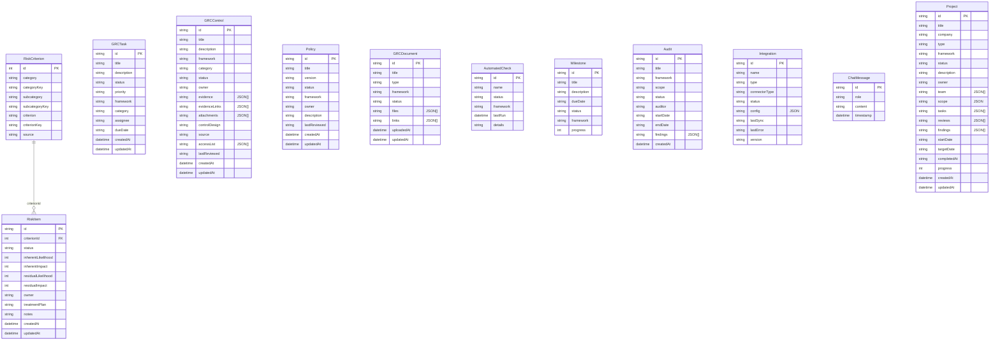

```mermaid
erDiagram
  RiskCriterion ||--o{ RiskItem : "criterionId"
  RiskCriterion {
    int id PK
    string category
    string categoryKey
    string subcategory
    string subcategoryKey
    string criterion
    string criterionKey
    string source
  }
  RiskItem {
    string id PK
    int criterionId FK
    string status
    int inherentLikelihood
    int inherentImpact
    int residualLikelihood
    int residualImpact
    string owner
    string treatmentPlan
    string notes
    datetime createdAt
    datetime updatedAt
  }

  GRCTask {
    string id PK
    string title
    string description
    string status
    string priority
    string framework
    string category
    string assignee
    string dueDate
    datetime createdAt
    datetime updatedAt
  }

  GRCControl {
    string id PK
    string title
    string description
    string framework
    string category
    string status
    string owner
    string evidence "JSON[]"
    string evidenceLinks "JSON[]"
    string attachments "JSON[]"
    string controlDesign
    string source
    string accessList "JSON[]"
    string lastReviewed
    datetime createdAt
    datetime updatedAt
  }

  Policy {
    string id PK
    string title
    string version
    string status
    string framework
    string owner
    string description
    string lastReviewed
    datetime createdAt
    datetime updatedAt
  }

  GRCDocument {
    string id PK
    string title
    string type
    string framework
    string status
    string files "JSON[]"
    string links "JSON[]"
    datetime uploadedAt
    datetime updatedAt
  }

  AutomatedCheck {
    string id PK
    string name
    string status
    string framework
    datetime lastRun
    string details
  }

  Milestone {
    string id PK
    string title
    string description
    string dueDate
    string status
    string framework
    int progress
  }

  Audit {
    string id PK
    string title
    string framework
    string scope
    string status
    string auditor
    string startDate
    string endDate
    string findings "JSON[]"
    datetime createdAt
  }

  Integration {
    string id PK
    string name
    string type
    string connectorType
    string status
    string config "JSON"
    string lastSync
    string lastError
    string version
  }

  ChatMessage {
    string id PK
    string role
    string content
    datetime timestamp
  }

  Project {
    string id PK
    string title
    string company
    string type
    string framework
    string status
    string description
    string owner
    string team "JSON[]"
    string scope "JSON"
    string tasks "JSON[]"
    string reviews "JSON[]"
    string findings "JSON[]"
    string startDate
    string targetDate
    string completedAt
    int progress
    datetime createdAt
    datetime updatedAt
  }
```
